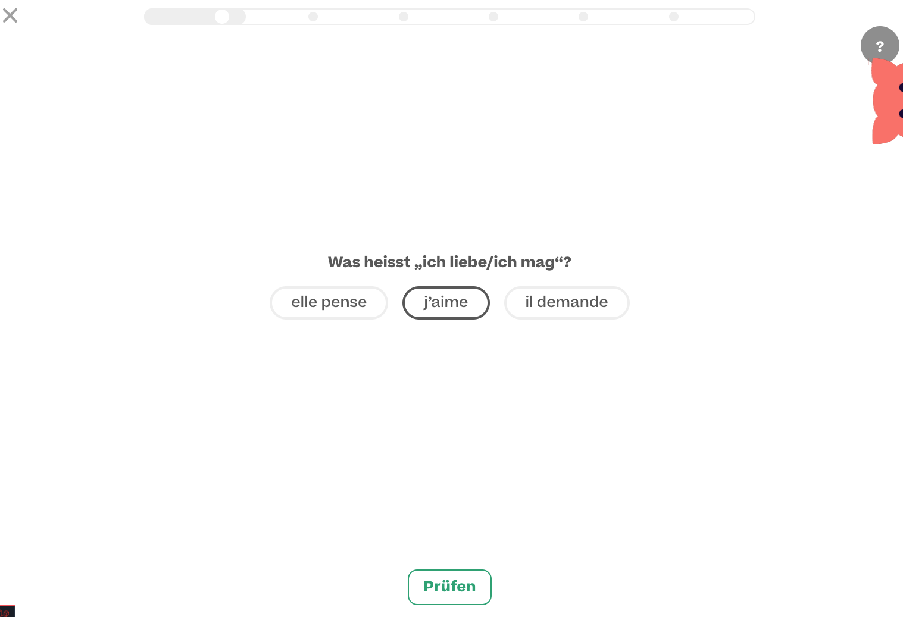

# Evulpo quiz challenge

Coding Task for Full Stack Developer at evulpo

## Task Descriptiom

Create a Single Choice Exercise Viewer, where you can go circulate in a random order through a collection of exercises, solve them, evaluate them and get back the score. For this you can use the Google Sheet database we set for you right here: https://docs.google.com/spreadsheets/d/1hzA42BEzt2lPvOAePP6RLLRZKggbg0RWuxSaEwd5xLc/edit?usp=sharing

Download this repository and start a new repository on your Github account with a copy of this repo. Please DO NOT start a branch or a fork from this repository.
Connect with the GOOGLE Sheet and retreive the data base over the API for this. We provide a code sample for that (CODE_SAMPLE_GAPI_CONNECTION)
Create the small web-app(website) using a simple file structure (index.html, main.js, style.css) -> We provide a code sample for that (CODE_SAMPLE_BASIC). Intentionally parts of the code have been deleted to avoid providing the solution but giving a hint and direction.
Try to commit often during your development process so that we can review the changes over time.
Document your work on the repository
Once you are done with your development, send me the link via Private Message on Slack to your github repository or to my email: andres@evulpo.com

## Focus

1. Communication and Code Readability
2. Interactivity
3. Data Connection and States
4. Memory Load and Performance
5. Front End
